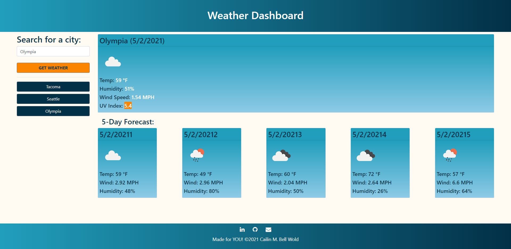

# 06 Weather Dashboard

## Description

A **weather dashboard** that will run in the browser and feature dynamically updated HTML and CSS using the [OpenWeather One Call API](https://openweathermap.org/api/one-call-api) and using `localStorage` to store any persistant data.

### Motivation

### Learning Targets

This exercise encompasses utilizing an API alongside Javascript to dynamically update HTML and CSS, storing and fetching data from local storage,...

## Core Objectives Met

1. When the page is visited, the user is presented with a weather dashboard that includes form inputs.
2. When a city is searched, the user is presented with current and future conditions for that city and the city is added to the search history.
3. When current weather conditions for a city are viewed, the user is presented with the city name, the date, an icon representation of weather conditions, the temperature, the humidity, the wind speed, and the UV index.
4. When the UV index is viewed, the user is presented with a color that indicates whether the conditions are favorable, moderate, or severe.
5. When future weather conditions for a city are viewed, the user is presented with a 5-day forecast that displays the date (IN PROGRESS), an icon representation of weather conditions, the temperature, the wind speed, and the humidity.
6. When a city from the search history is clicked, the user is again presented with current and future conditions for that city.

## Screen Shot

 

## Deployed Application

https://cailinbellwold.github.io/Weather-Dashboard/
#
